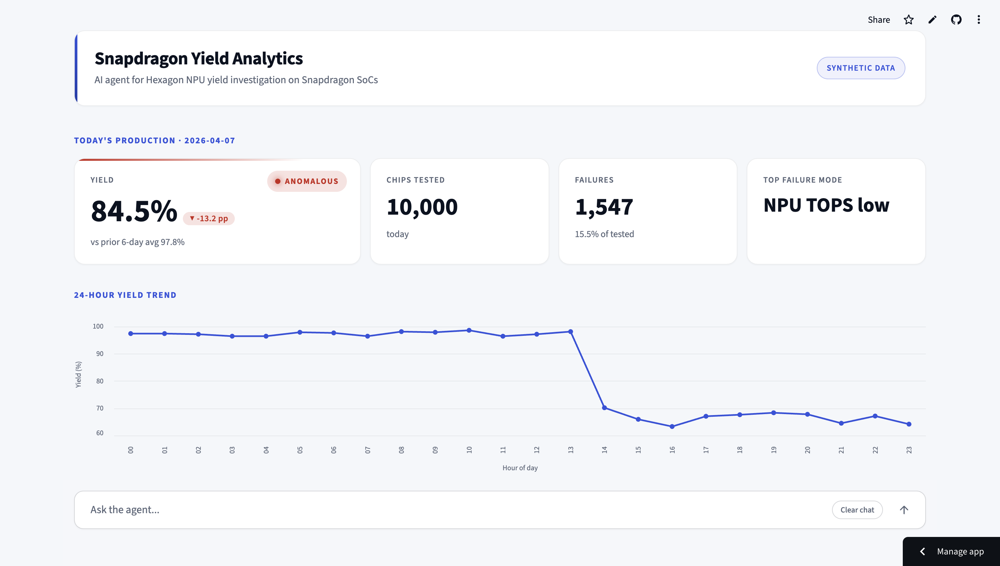

# AI-Powered Yield Analytics for Snapdragon SoC Production

An AI agent that automates yield root cause analysis for Snapdragon chip manufacturing, focusing on Hexagon NPU performance validation. Built with Claude, Python, and Streamlit.

## Problem Statement

A fab ships 10,000 Snapdragon SoCs a day. Every chip is tested before it leaves the line: AI throughput on the Hexagon NPU, NPU power draw, CPU frequency, memory bandwidth, die temperature. When yield drops on a given shift, the engineer has to figure out which subsystem moved, by how much, and on which lots, before another shift's worth of bad chips ships.

The traditional workflow is a few hours of manual SQL, Excel filtering, and chart-building: pull today's data, filter by machine and time and failure type, build charts to visualize patterns, cross-reference sensor data, write a summary report. Two hours, often more.

The AI-augmented workflow this project demonstrates collapses that into a single plain-language question. The engineer asks "why did yield drop today?", and a Claude-powered agent calls a small set of predefined tools (database query, SPC metrics, anomaly detection, chart generation, structured report) to surface the root cause in under thirty seconds.

The dataset and product framing are tied to Qualcomm's actual stack: Snapdragon SoCs, with the Hexagon NPU as the focused subsystem under test. The dataset is fully synthetic and clearly labeled as such; no real fab data is used. The point of the demo is not to claim deep semiconductor expertise; it is to show that the structured tool-using agent pattern can speed up the kind of root-cause workflow Qualcomm's Fab Systems and Data Operations team builds for its yield engineers.

## Demo

The app is deployed on Streamlit Community Cloud. The live URL is shared with recruiters directly rather than published here, so the Anthropic API budget behind the demo stays predictable. The repository is fully runnable locally; see "How to Run It" below.

<a href="https://youtu.be/FCCGSN_Ipb8" target="_blank">
  
</a>

<p><a href="https://youtu.be/FCCGSN_Ipb8" target="_blank">▶ Watch the 2-minute demo</a></p>

## Architecture

```
User question (natural language)
        │
        ▼
   Streamlit UI
        │
        ▼
  Claude API agent loop  ◄──────────┐
        │                            │
        ▼                            │
  Tool selection                     │
        │                            │
        ▼                            │
  ┌─────┴────────────────────┐       │
  ▼     ▼     ▼     ▼     ▼  ▼       │
query  spc  detect  chart  report   │
  │     │     │     │     │  │       │
  ▼     ▼     ▼     ▼     ▼  ▼       │
SQLite  pandas  matplotlib  text     │
  │     │     │     │     │  │       │
  └─────┴─────┴─────┴─────┴──┘       │
        │                            │
        ▼                            │
  Tool results sent back to agent ───┘
        │
        ▼
  Final summary + chart shown to user
```

The agent loop follows the standard Anthropic Messages tool-use pattern: send the question with a tool catalog, read the response, execute any `tool_use` blocks locally, send the results back as `tool_result` blocks, repeat until `end_turn`. The agent never gets free-form SQL or shell access, only the five predefined tools. This matches the FSDO job description's "predefined code paths" requirement and keeps the agent inside a tightly scoped sandbox.

The five tools:

1. `query_database` runs parameterized reads against the SQLite database. The agent picks one of four query types (`summary`, `date_range`, `failed_only`, `wafer_range`); it cannot author SQL.
2. `calculate_spc_metrics` computes mean, sample standard deviation, and three-sigma control limits for one metric over a time window, plus per-subgroup means and out-of-control flags.
3. `detect_anomalies` buckets chips into hourly windows, flags hours over a failure-rate threshold, and Pearson-correlates each metric's hourly mean with the hourly failure rate.
4. `generate_chart` renders one of three matplotlib templates (SPC chart, dual-axis correlation chart, failure timeline) and returns the saved PNG path.
5. `write_summary_report` renders the final structured markdown report from findings, a root-cause hypothesis, and recommendations.

Two prompt-caching breakpoints land on the system + tools prefix and the conversation prefix, so cached input tokens cost a tenth of the normal rate and do not count toward the per-minute rate limit. A four-iteration yield-drop investigation costs a few cents on Claude Sonnet 4.6.

## How It Works

A walkthrough of the canonical demo question.

**1. The engineer asks a question.**

> "Why did yield drop today?"

**2. The agent calls tools in sequence.**

- `query_database(query_type="summary")` returns the seven-day yield rollup. The agent identifies today as the most recent day in the window and notices its yield (about 85 percent) is well below the prior six-day average (about 98 percent).
- `detect_anomalies(start_time="2026-04-07 00:00:00", end_time="2026-04-08 00:00:00")` returns hourly failure rates plus Pearson correlations between each metric's hourly mean and the failure rate. NPU TOPS comes back strongly negative (around -0.99); NPU power strongly positive (around +0.99); CPU frequency, memory bandwidth, and die temperature all hover near zero. Failures cluster from 14:00 onward.
- `generate_chart(chart_type="correlation_chart", primary_metric="npu_tops", secondary_metric="npu_power_w", ...)` saves a dual-axis chart that shows NPU throughput crashing as NPU power rises through the afternoon.
- `generate_chart(chart_type="failure_timeline", ...)` saves a scatter of every failed chip on the drift day, colored by `failure_reason`. Over 90 percent of the dots fall on the "NPU TOPS below spec" row.
- `write_summary_report(findings=[...], root_cause_hypothesis="...", recommendations=[...])` returns the rendered markdown report.

**3. The engineer sees the final report.**

The Streamlit page renders the markdown report inline. Findings cover the magnitude of the drop (about 85 percent today versus an approximate 98 percent baseline), the hourly pattern (clean morning, sharp drop at 14:00, sustained through end of day), and the failure-mode concentration (over 90 percent of failures are NPU TOPS below spec). The two charts appear inline at the points in the narrative where they reinforce a finding. The report ends with a root-cause hypothesis pointing at a Hexagon NPU power-domain excursion and prioritized recommendations: quarantine the afternoon-shift wafers, run secondary validation on the affected lots, and run SPC by `wafer_id` to localize the excursion further.

Total wall-clock time from question to final report: about 25 to 30 seconds.

## Tech Stack

| Component | Choice |
|---|---|
| Language | Python 3.12 |
| Database | SQLite |
| Data manipulation | pandas, numpy |
| Statistics | scipy |
| Charts | matplotlib (agent), altair (UI dashboard) |
| AI orchestration | Anthropic Claude API with tool use, model `claude-sonnet-4-6` |
| UI | Streamlit |
| Hosting | Streamlit Community Cloud |
| Environment | Python venv |
| Tests | pytest (74 tests passing as of writing) |
| Version control | Git, GitHub |

## How to Run It

The fastest path is to clone the repo and run `setup.sh`. The script creates the venv, installs dependencies, generates the synthetic dataset, loads it into SQLite, and copies `.env.example` to `.env` for you to fill in.

```bash
git clone https://github.com/mnoriega-mx/snapdragon-yield-analytics.git
cd snapdragon-yield-analytics
./setup.sh
```

Add your Anthropic API key to `.env`, activate the venv, and launch the UI:

```bash
# Edit .env and paste ANTHROPIC_API_KEY=sk-ant-...
source venv/bin/activate
streamlit run ui/app.py
```

If you prefer to run each step manually (this is what `setup.sh` does):

1. Clone the repo: `git clone https://github.com/mnoriega-mx/snapdragon-yield-analytics.git && cd snapdragon-yield-analytics`
2. Create and activate the venv: `python3 -m venv venv && source venv/bin/activate`
3. Install dependencies: `pip install -r requirements.txt`
4. Configure secrets: `cp .env.example .env`, then add your Anthropic API key
5. Generate the dataset: `python data/generate_data.py`
6. Load it into SQLite: `python data/setup_database.py`
7. Launch the UI: `streamlit run ui/app.py`

Other useful commands once the project is set up:

```bash
# Run the full test suite (no API key required)
pytest -v

# Ask the agent from the command line
python -m agent.run "How many chips were produced today?"
python -m agent.run --trace "Why did yield drop today?"

# Run the live-API scenario validation harness (writes docs/scenario_validation.md)
python scripts/validate_scenarios.py
```
